# VINFAST AI MOBILITY INTELLIGENCE LAB

Two practical AI concepts demonstrating how vehicle data can become a continuously improving intelligence platform.

**POC 1:** ADAS Human-in-the-Loop Learning Platform

**POC 2:** EV Fleet Health & Charging Intelligence Platform

> **This project is an independent technology demonstration created using synthetic data. It is not an official VinFast product.**
> No VinFast APIs, telemetry or datasets are used. The "models" are simulations of how such models behave, not production autonomous-driving models.

**Drive → Observe → Learn → Predict → Optimize → Improve**

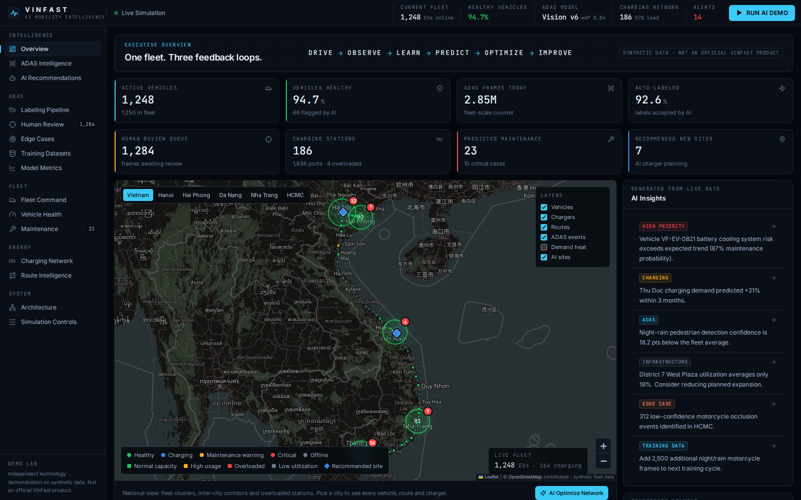

---

## Problem

**ADAS.** Driver-assistance systems need enormous amounts of accurately labeled data. Manual labeling is slow, expensive and hard to scale. AI-only labeling has the opposite problem: wrong labels silently enter the training set.

**Fleet and charging.** A connected fleet produces operational data all day, but most of it is only looked at after something breaks. Charger locations are often decided from static planning assumptions rather than from where vehicles actually drive and charge.

## Solution

One fleet, three feedback loops:

| Loop | Data | AI | Human / decision | What comes back |
|---|---|---|---|---|
| **Safer ADAS** | Camera + LiDAR frames | Auto-labeling with confidence scoring | Low-confidence labels go to a reviewer | Corrections become the next training dataset |
| **Healthier vehicles** | Battery, motor, tire telemetry | Interpretable risk scoring + anomaly detection | Service is scheduled before failure | Outcomes refine the health model |
| **Smarter charging** | GPS routes, charging sessions | Demand forecast + site scoring | Planner adds, expands — or declines to build | New usage data validates the plan |

**Ride Demand 24h** builds on the charging loop for ride-hailing in Ho Chi Minh City. Simulated in-vehicle IoT signals (seat occupancy, door events, GPS, ride requests) feed a 24-hour zone forecast of passengers, EV supply and trips from origin to destination. Drivers see which zone to be in and when; the network team sees which stations are too small, too big or missing.

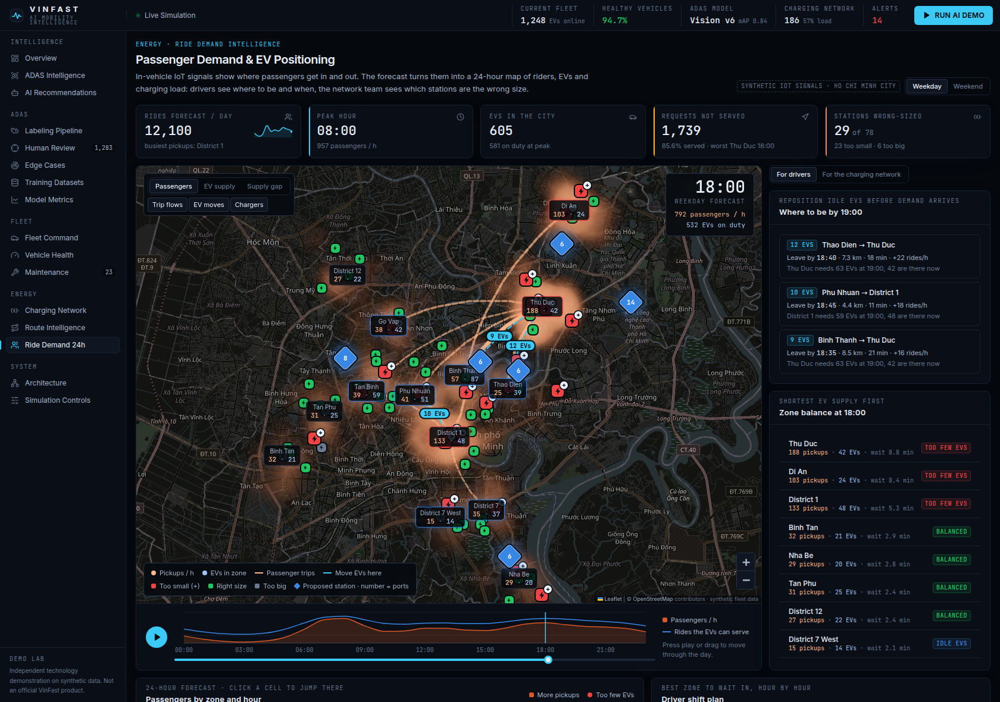

**Demand Forecast Model** is a real trained model: scikit-learn gradient-boosted trees (Poisson loss) fitted on 49 days of synthetic hourly ride history and scored on a held-out week against the naive "same hour last week" forecast. The page shows its error, predicted versus actual per zone, which features it relies on, and a what-if predictor (zone, day, hour, rain). The history is synthetic, so the scores describe how well it recovers the simulated patterns, not real-world accuracy.

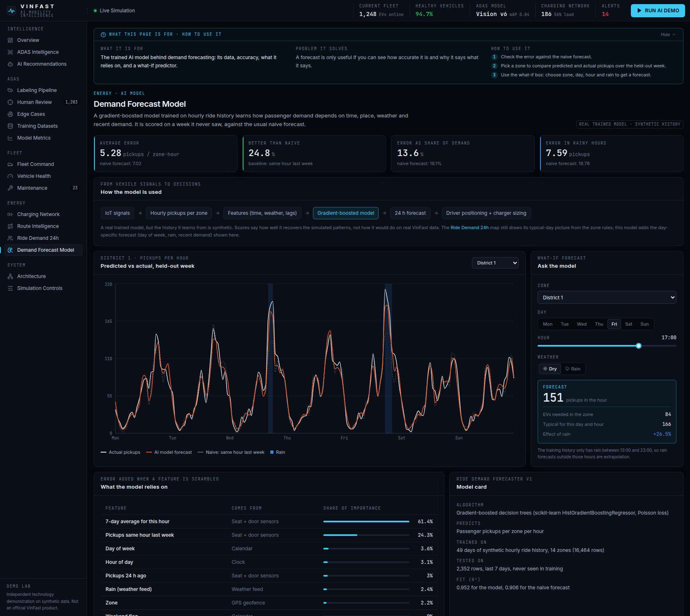

**In-app guide.** The Overview opens with what the app is for, the problems it solves and how to use each main feature. Every other page carries a collapsible bar with the same three things for that page.

The point is the system, not a single model: data creates intelligence, intelligence creates decisions, humans validate the important ones, actions create new data.

## Architecture

```
                     ┌──────────────┐
                     │   EV FLEET   │
                     └──────┬───────┘
          ┌─────────────────┼─────────────────┐
          ↓                 ↓                 ↓
       ADAS DATA         TELEMETRY          ROUTES
          ↓                 ↓                 ↓
    AUTO LABELING      HEALTH AI       MOBILITY AI
          ↓                 ↓                 ↓
    HUMAN REVIEW       MAINTENANCE     CHARGER DEMAND
          ↓                 ↓                 ↓
       DATASET       SERVICE PLANNING  NETWORK OPTIMIZATION
          └─────────────────┼─────────────────┘
                            ↓
                   CONTINUOUS LEARNING
                            ↓
                    BETTER EV ECOSYSTEM
```

The diagram above is the concept. The rest of this section is what actually runs.

### Goals and non-goals

| Goals | Non-goals |
|---|---|
| Show the full loop from vehicle data to a decision, end to end, on one laptop | Production scale, security hardening or multi-tenant use |
| Keep every decision rule readable and unit-tested | Real perception models or real VinFast data |
| Make each engine separable, so it can become its own service later | High availability; the demo is one process with in-memory state |
| Same seed, same world, same numbers on every run | Tuned model accuracy on real-world data |

### System

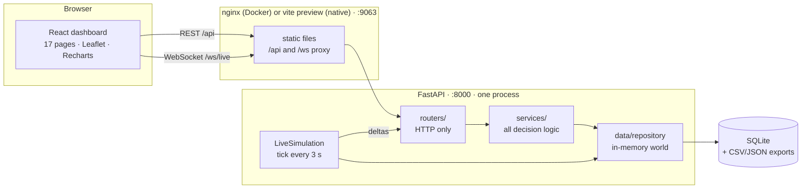

### Layers and the rules between them

| Layer | Path | Owns | Must not |
|---|---|---|---|
| Pages | `frontend/src/pages` | One screen each; local UI state | Call `fetch` directly, or share state except through `lib/` |
| Frontend library | `frontend/src/lib` | API client (`api.ts`), live store (`live.ts`), map layers (`map.ts`), payload types (`types.ts`), guide text (`guide.ts`) | Contain page-specific layout |
| Routers | `backend/app/routers` | URL, parameter validation, status codes | Contain business logic |
| Services | `backend/app/services` | Every decision rule, as plain functions over plain data | Import FastAPI, or read or write storage directly |
| Repository | `backend/app/data` | The world state, persistence, the synthetic generator | Make decisions |

Dependencies point one way: pages → lib → routers → services → repository. A service never imports a router, and nothing outside `app/data` touches SQLite. This is what makes each engine testable without a server and movable into its own process later. The one exception is `telemetry_service`, which imports FastAPI's `WebSocket` type because it holds the connected clients. `backend/tests/test_architecture.py` fails the build if any other module breaks these rules.

### Engines

Each file in `backend/app/services` is one engine with explicit inputs and outputs.

| Engine | What it decides | API | Page |
|---|---|---|---|
| `adas_label_engine` | Confidence per label; accept, spot-check or human review | `/api/adas/frames`, `/pipeline` | Labeling Pipeline |
| `review_service` | Applies a human correction and adds it to the next dataset | `/api/adas/review/{id}` | Human Review |
| `edge_case_engine` | Which scenarios the model is likely to get wrong | `/api/adas/edge-cases` | Edge Cases |
| `model_metrics` | Model comparison (mock numbers) | `/api/adas/model-metrics` | Model Metrics |
| `maintenance_engine` | Risk score, predicted component, reason codes; IsolationForest anomaly score | `/api/maintenance/predictions` | Vehicle Health, Maintenance |
| `service_scheduler` | Groups vehicles into a service plan | `/api/maintenance/optimize-schedule` | Maintenance |
| `charger_optimizer` | Add, expand or do not build | `/api/chargers/recommendations` | Charging Network |
| `route_analyzer` | Trips, replay samples, heatmaps | `/api/routes`, `/api/vehicles/{id}/route` | Route Intelligence |
| `ride_demand` | 24-hour passengers, EV supply, trip flows, driver moves, charger sizing | `/api/rides/forecast` | Ride Demand 24h |
| `demand_model` | Trained gradient-boosted forecast of pickups per zone-hour | `/api/rides/model`, `/predict` | Demand Forecast Model |
| `telemetry_service` | The live simulation tick and its WebSocket deltas | `/ws/live`, `/api/sim/*` | Fleet Command, Simulation Controls |
| `copilot` | Keyword intent, answered from the engines above | `/api/copilot/ask` | AI Recommendations |
| `demo_orchestrator` | The 11 guided-demo steps, each a real state change | `/api/demo/step/{n}` | RUN AI DEMO |

### Request path and live path

- **Read:** a page calls `useApi("/api/…")` → router validates parameters → service computes from the repository's in-memory world → JSON.
- **Write:** reviews, bookings and dataset counts go through the repository, which updates memory and writes through to SQLite, then the frontend bumps a refresh key so open pages refetch.
- **Live:** `LiveSimulation.tick()` advances the world every 3 s and broadcasts a compact delta (`[index, lat, lon, soc, status, speed]` per moved vehicle) over `/ws/live`. The browser falls back to polling `/api/live/tick` if the socket drops.

More detail: [docs/architecture.md](docs/architecture.md) · [docs/adas-workflow.md](docs/adas-workflow.md) · [docs/fleet-ai-workflow.md](docs/fleet-ai-workflow.md)

## Extending the POC

Adding a feature touches the same six places every time. Ride Demand 24h was added exactly this way.

1. **Engine:** add `backend/app/services/<name>.py`. Pure functions, constants named at the top, the formula in the module docstring.
2. **Route:** add or extend a file in `backend/app/routers` and register new routers in `backend/app/main.py`. Validate inputs with types (`Literal`, `Query(ge=, le=)`), so bad input returns 422 without custom code.
3. **Tests:** rules in `backend/tests/test_engines.py`, the HTTP contract in `backend/tests/test_api.py`.
4. **Types:** mirror the response in `frontend/src/lib/types.ts`.
5. **Page:** add `frontend/src/pages/<Name>.tsx` from the shared pieces in `components/ui.tsx` and `components/MapView.tsx`; add the route in `App.tsx` and the nav entry in `components/AppShell.tsx`.
6. **Guide:** add the page's purpose, problem and steps to `frontend/src/lib/guide.ts`. The bar at the top of the page and the Overview card come from that entry.

Conventions that keep it maintainable:

- **Configuration** comes from environment variables read in one place, `backend/app/config.py`. Nothing else calls `os.getenv`.
- **Tunable numbers** are module-level constants with a comment saying what they mean, never literals inside a function.
- **Honesty labels:** anything simulated or mock says so in the API response (`note`) and on the page (`MockTag`).
- **Determinism:** all randomness is seeded from `SIM_SEED`, so tests can assert exact names and counts.
- **One command checks everything:** `make check` runs the backend tests, the frontend typecheck and the production build. CI runs the same on every push ([.github/workflows/ci.yml](.github/workflows/ci.yml)).

## Scaling path

The demo is one process holding the world in memory. That is the right size for a POC and the wrong size for a fleet. This is the order things would break, and what replaces them. None of it is built here.

| Pressure | What breaks first | Change | Why it is a contained change |
|---|---|---|---|
| More API traffic | One uvicorn process | Run several workers behind a load balancer | Only after state moves out of process memory (next row) |
| More than one process | In-memory world in `Repository` | Back the repository with PostgreSQL (+ PostGIS for zones and routes) and Redis for hot state | Services only talk to the repository interface, so they do not change |
| Real vehicles | The 3-second simulation tick | Vehicle gateway → MQTT/Kafka → stream processor writing to a time-series store | `telemetry_service` is the only producer of position deltas |
| Many dashboard users | Per-process WebSocket broadcast | Pub/sub fan-out (Redis or NATS) behind the socket servers | The delta format already is the message |
| Heavy model work | Training and forecasting inside request handlers | Offline training jobs, a model registry, forecasts written to a table and served from cache | `demand_model` already separates `train` from `predict` |
| Team growth | One backend deployable | One service per engine on Kubernetes, CPU and GPU node pools | Each engine is already a module with explicit inputs and outputs; see [deployment/k8s/production-topology.yaml](deployment/k8s/production-topology.yaml) |
| Larger frontend | One JavaScript bundle of about 1 MB | Route-level code splitting with `React.lazy` | Each page is already a separate default export |

The component-by-component version of this is in [Future production architecture](#future-production-architecture).

## Screenshots

| | |
|---|---|
| 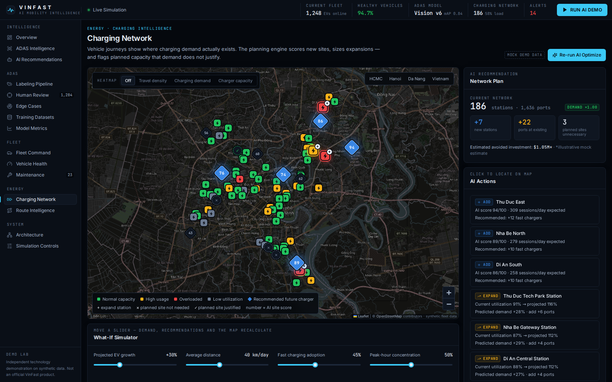 **Charging Network** — AI Optimize: add, expand, do not expand | 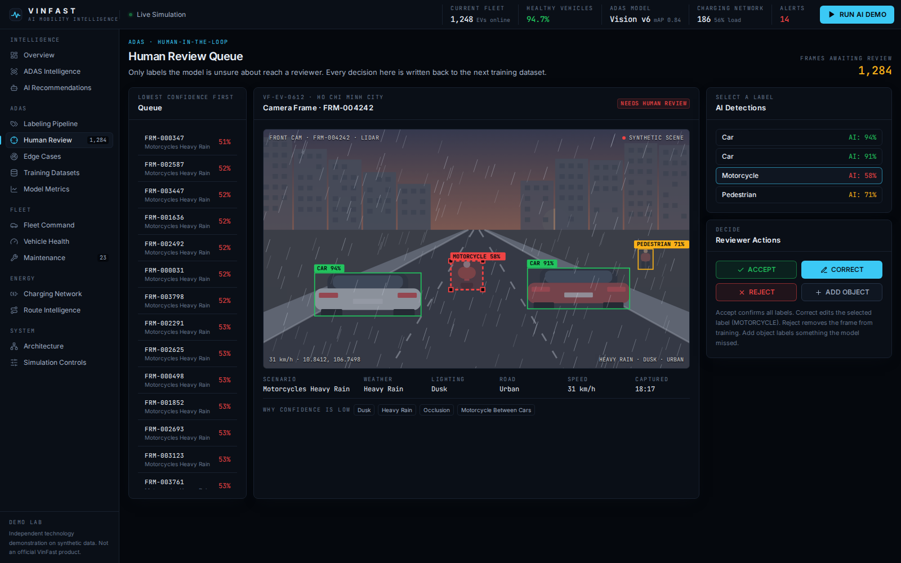 **Human Review** — correct a low-confidence label |
| 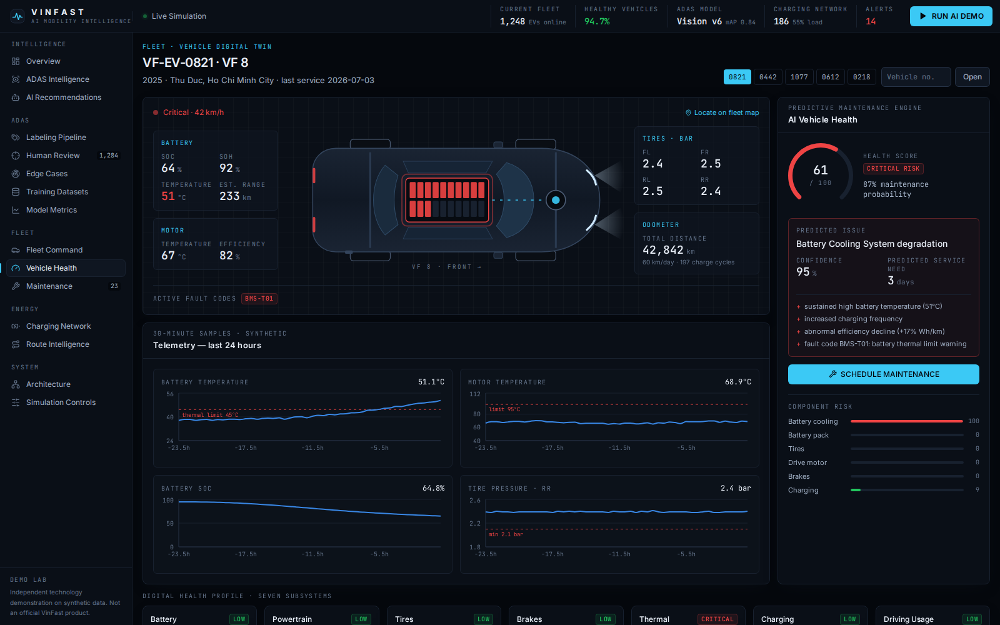 **Vehicle Health** — telemetry, prediction, reason codes | 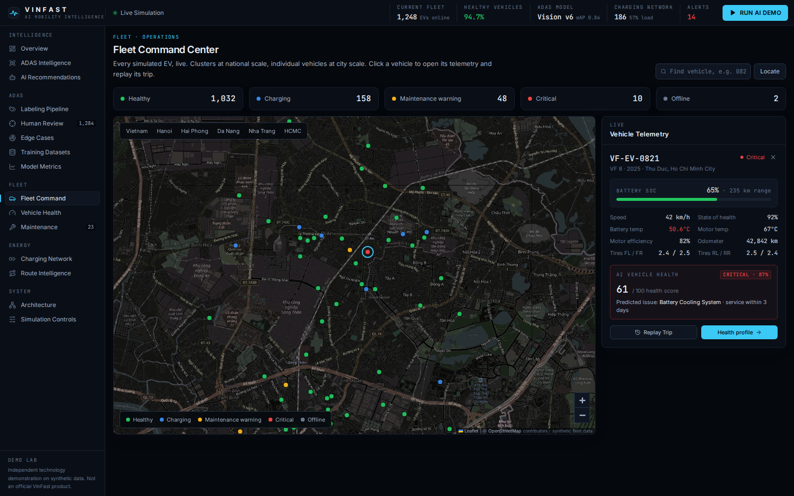 **Fleet Command** — live fleet and trip replay |
| 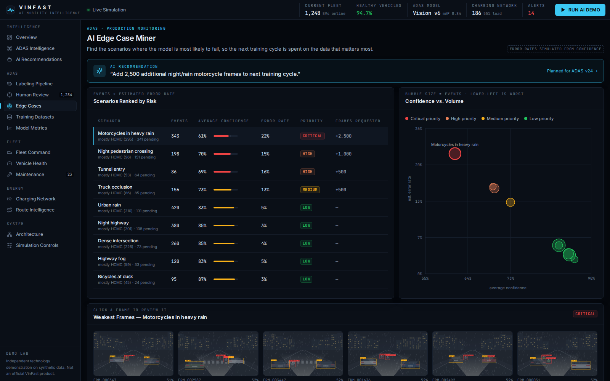 **Edge Case Miner** — where the model is likely to fail | 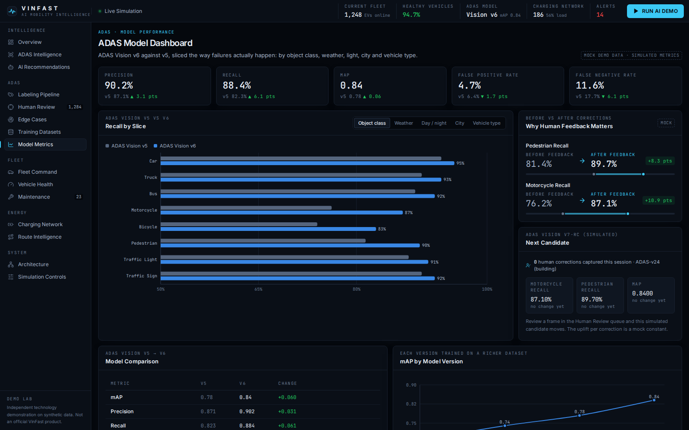 **Model Metrics** — v5 vs v6 (mock) |
| 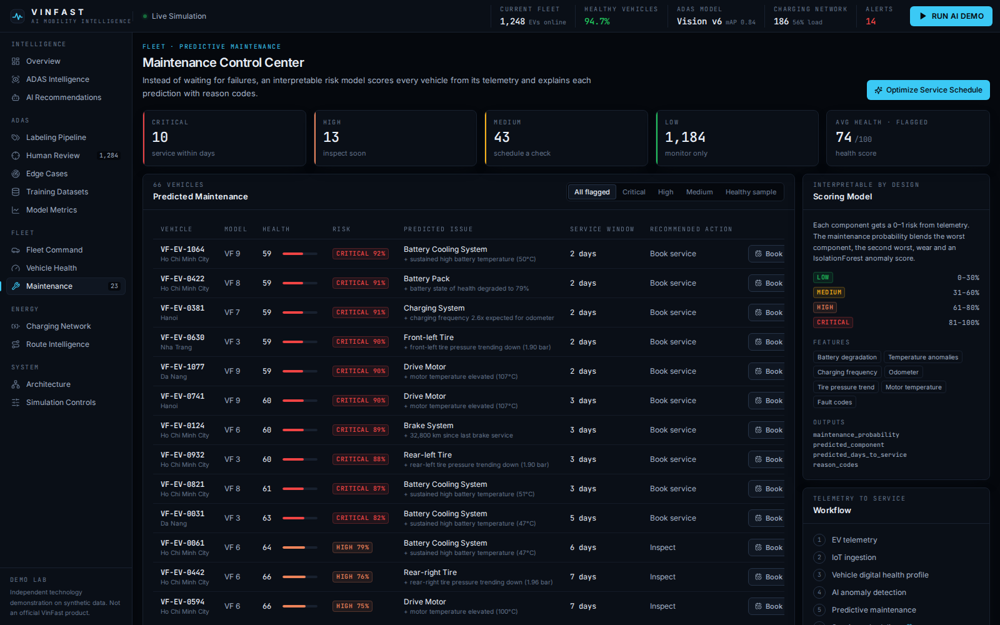 **Maintenance** — ranked predictions, schedule optimizer | 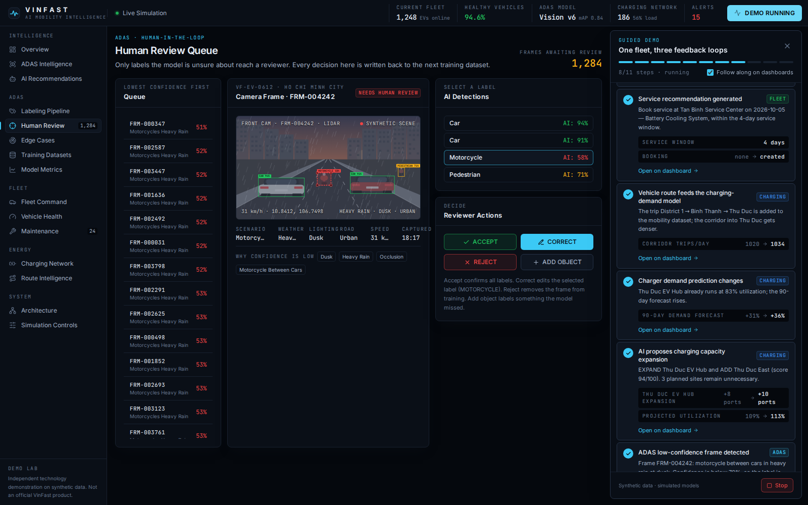 **RUN AI DEMO** — 11 steps across all three loops |

All screenshots are in [docs/screenshots](docs/screenshots).

## Technology

| Layer | Stack |
|---|---|
| Frontend | React 18, TypeScript, Vite, Tailwind CSS, Recharts, Leaflet + OpenStreetMap, Lucide icons, Zustand |
| Backend | Python 3.11+, FastAPI, Pydantic v2, pandas, numpy, scikit-learn (IsolationForest) |
| Data | SQLite for application data; CSV/JSON for generated source datasets (`data/`) |
| Live updates | WebSocket (`/ws/live`) with HTTP polling fallback |
| Deployment | Dockerfile per service, `docker-compose.yml`, optional Kubernetes examples |

No GPU, no external LLM and no API keys are required.

## How to run

### Launcher (local machine or AWS EC2)

```bash
./start.sh            # Docker if it is usable, otherwise a Python venv + the built dashboard
./start.sh native     # force the no-Docker path (needs Python 3.11+ and Node 20+)
./start.sh status     # what is running, and the URLs
./start.sh stop
```

Both services listen on `0.0.0.0` and the script prints the URLs with the machine's public IP. On EC2, allow inbound TCP 9063 in the security group, then open `http://<public-ip>:9063`. Port 8000 is only needed for the API docs. The services keep running after you log out of SSH; logs are in `.run/`.

### Docker (one command)

```bash
docker compose up --build
```

- Dashboard: <http://localhost:9063>
- API docs: <http://localhost:8000/api/docs>

The first start generates the synthetic world (a few seconds) and writes it to `./data`. Ports and world size can be changed by copying `.env.example` to `.env`.

### Development mode

Two terminals. Requires Python 3.11+ and Node 20+.

```bash
# 1 — backend on :8000
cd backend
python -m venv .venv && source .venv/bin/activate      # Windows: .venv\Scripts\activate
pip install -r requirements.txt
uvicorn app.main:app --reload --port 8000

# 2 — frontend on :5173 (proxies /api and /ws to :8000)
cd frontend
npm install
npm run dev
```

Open <http://localhost:5173>.

### Tests and tools

```bash
make check                                                           # everything CI runs: tests, typecheck, build
cd backend && pip install -r requirements-dev.txt && pytest          # engine + API tests
cd frontend && npm run build                                         # typecheck + production build
python scripts/generate_telemetry.py --stream --ticks 5              # print telemetry events as JSON lines
python scripts/generate_telemetry.py --regenerate                    # rebuild datasets from the seed
```

The map needs internet access for OpenStreetMap tiles; everything else works offline.

## Demo walkthrough

Press **RUN AI DEMO** (top right). Eleven steps run in sequence, each one a real state change in the backend, while the dashboards follow along:

1. New vehicle telemetry arrives
2. EV develops a battery temperature anomaly
3. Maintenance AI detects the anomaly
4. Service recommendation is generated
5. The vehicle's route feeds the charging-demand model
6. Charger demand prediction changes
7. AI proposes charging capacity expansion
8. An ADAS low-confidence frame is detected
9. A human corrects the motorcycle label
10. The frame enters the next training dataset
11. Updated model metrics appear

Then try the two centrepieces by hand:

- **Charging Network → AI Optimize Network.** The map changes: blue diamonds are new sites (Thu Duc East scores 94), `+` marks stations to expand, `✕` marks planned sites the model advises *against*. Move the what-if sliders and watch the plan recalculate.
- **Human Review.** Pick the selected motorcycle label, press **CORRECT**, change class or box, save. The correction lands in Dataset v24 and the simulated next model candidate moves on the Model Metrics page.

A spoken script for a 2-minute walkthrough is in [docs/demo-script.md](docs/demo-script.md).

## API

Interactive documentation: `/api/docs`.

| Method | Endpoint | Purpose |
|---|---|---|
| GET | `/api/dashboard/summary` | Executive KPIs |
| GET | `/api/dashboard/insights` | AI insight feed |
| GET | `/api/vehicles` | Fleet list (filter by city, status, risk, search; paginated) |
| GET | `/api/vehicles/map` | Compact whole-fleet payload for maps |
| GET | `/api/vehicles/{id}` | Vehicle, prediction, digital twin |
| GET | `/api/vehicles/{id}/telemetry` | Recent telemetry history |
| GET | `/api/vehicles/{id}/route` | Today's trip, timeline, replay samples |
| GET | `/api/maintenance/predictions` | Ranked maintenance predictions |
| POST | `/api/maintenance/optimize-schedule` | Group vehicles into a service plan |
| POST | `/api/maintenance/schedule/{id}` | Book service for a vehicle |
| GET | `/api/chargers` | Stations with availability and recommendation |
| GET | `/api/chargers/recommendations` | Planning engine; query params are the what-if sliders |
| GET | `/api/routes`, `/api/routes/heatmap` | Routes and density layers |
| GET | `/api/rides/forecast` | 24-hour passenger demand, EV supply, trip flows, driver moves and charger sizing (`day=weekday\|weekend`) |
| GET | `/api/rides/model` | Trained demand model: scores versus baseline, feature importance, test-week predictions |
| GET | `/api/rides/model/predict` | What-if forecast for one zone and hour (`zone`, `hour`, `day_of_week`, `rain`) |
| GET | `/api/adas/frames`, `/api/adas/frames/{id}` | Frames with simulated detections |
| GET | `/api/adas/pipeline` | Auto-label routing statistics |
| GET | `/api/adas/review-queue` | Frames awaiting a human |
| POST | `/api/adas/review/{frame_id}` | Accept, correct, reject or add an object |
| GET | `/api/adas/edge-cases` | Edge-case mining report |
| GET | `/api/adas/model-metrics` | Model dashboard data (mock) |
| GET | `/api/datasets` | Training dataset versions |
| POST | `/api/copilot/ask` | Deterministic copilot |
| POST | `/api/demo/step/{n}` | One step of the guided demo |
| GET/POST | `/api/sim/state`, `/control`, `/inject`, `/reset` | Simulation controls |
| WS | `/ws/live` | Live simulation deltas |

## Future production architecture

What would replace each demo component:

| In this demo | In production |
|---|---|
| Simulation tick + WebSocket | Vehicle gateway, MQTT / event streaming (Kafka) over 5G / WiFi |
| SQLite + CSV/JSON | Object storage for camera/LiDAR, telemetry store, data lake, feature store, relational DB |
| Rule-based confidence simulation | Real perception model inference on GPU, with calibrated confidence |
| Weighted risk score + IsolationForest | Per-component models trained on service history; survival analysis for time-to-service |
| Authored demand features | Demand forecasting from trip and session history; real road-network routing |
| Dataset version records | Dataset versioning (DVC/lakeFS), experiment tracking, model registry, CI/CD for models |
| One FastAPI process | One stateless service per engine on Kubernetes, GPU and CPU node pools |
| Deterministic copilot | LLM with retrieval over the same APIs, with guardrails |

Kubernetes examples: [deployment/k8s](deployment/k8s).

## Limitations

- **Everything is synthetic.** Vehicles, telemetry, stations, routes, frames, metrics and monetary values are generated from a seed. Dollar figures are illustrative mock estimates.
- **No real perception.** The auto-label engine assigns confidences by rule; camera frames are drawn scenes, not images. Model metrics are authored numbers, and the "next candidate" uplift is a mock constant per correction.
- **Edge-case error rates are derived from confidence**, not from audited ground truth.
- **Routes are not snapped to roads.** They are smoothed lines between district centres, and vehicles can appear to drive through buildings or water.
- **The ride demand forecast is a zone model, not a trained network.** Hourly profiles per zone type, a gravity model for trips and a rule for where idle EVs wait; no real passenger, sensor or ride-hailing data. It covers Ho Chi Minh City only, and its charger sizing looks at today's busiest hour, so it differs from the 90-day plan on the Charging Network page.
- **The maintenance model is a transparent scoring function**, calibrated on the synthetic fleet, not trained on service records.
- **Single process, in-memory simulation.** Not built for concurrency or scale; SQLite persistence covers reviews, bookings and dataset counts only.
- **Kubernetes manifests are examples** and were not run against a cluster.
- Files written to `./data` by Docker are owned by root; delete the folder (or `chown` it) before switching to development mode on Linux.

## Repository layout

```
backend/
  app/routers/    HTTP handlers, one file per API area
  app/services/   one engine per file: all decision logic
  app/data/       repository (world state), SQLite persistence, synthetic generator
  app/schemas/    Pydantic response models
  tests/          test_engines.py (rules) · test_api.py (HTTP contract) · test_architecture.py (layering)
frontend/
  src/pages/      one screen per file
  src/components/ shared UI, map container, app shell, guide
  src/lib/        API client, live store, map layers, types, guide text
data/             generated SQLite database and CSV/JSON datasets (created on first run)
scripts/          generate_telemetry.py: dataset generation and telemetry stream
docs/             architecture, workflows, demo script, business value, screenshots
deployment/       optional Kubernetes examples
start.sh          launcher (Docker or native), EC2-aware
Makefile          check, test, start, stop
.github/          CI: tests, typecheck and build on every push
```
